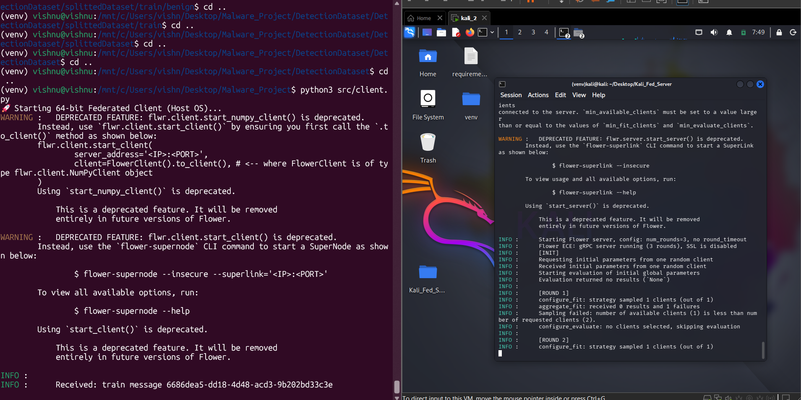

# 64-bit Federated NIDPS
A decentralized Network Intrusion Detection System (NIDPS) using **Federated Learning** and **64-bit precision** MobileViT.

## 🚀 Overview
This project demonstrates a privacy-preserving AI pipeline where a central **Kali Linux** server aggregates mathematical updates from a **Windows/WSL** client.
- **Architecture:** MobileViT-XXS (Vision Transformer)
- **Precision:** Float64 (Double Precision) for high-fidelity gradient updates.
- **Frameworks:** Flower (FL), PyTorch, Timm.
- **Data Set:** https://www.kaggle.com/datasets/kokykg/malware-detection-with-images

## 🛠️ Setup
1. Clone the repo.
2. Install dependencies in both OS's: `pip install -r requirements.txt`
3. make changes in client.p # REPLACE WITH YOUR KALI VM's IP ADDRESS! ---> fl.client.start_numpy_client(server_address="Your Kali IP:8080", client=MalwareClient())
4. change your data path in utils.py ----> data_path = f"/mnt/c/Users/vishn/Desktop/Malware_Project/DetectionDataset/DetectionDataset/splittedDataset/{partition}"
5. and evaluate.py ---->  DATA_PATH = "/mnt/c/Users/vishn/Desktop/Malware_Project/DetectionDataset/DetectionDataset/splittedDataset/test"
6. Start the server on Kali: `python server.py`
7. Start the client on Windows: `python src/client.py`

### training of model and communication between client and server

